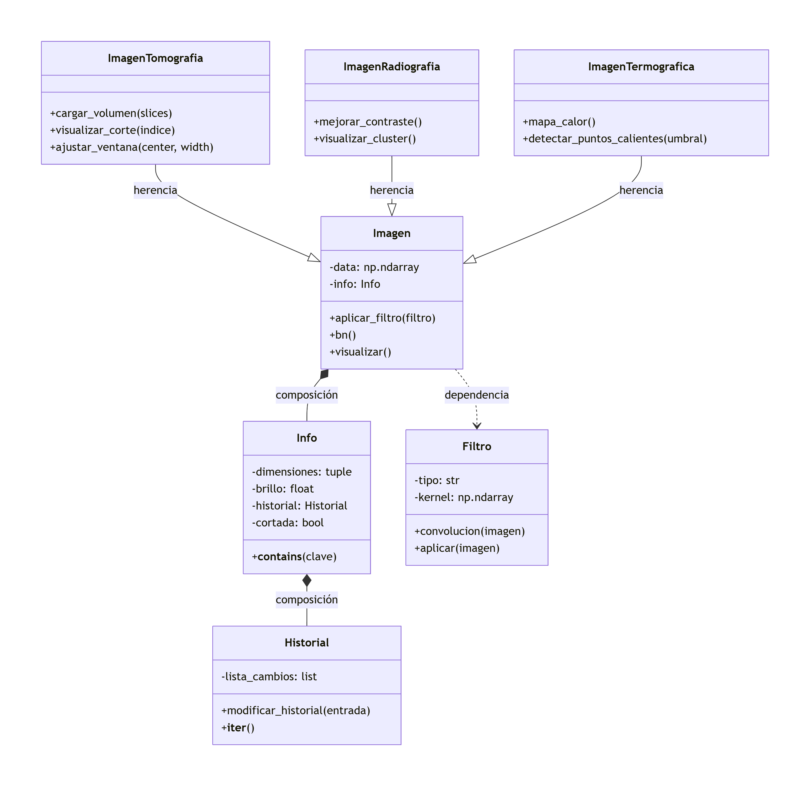

## BioImagenes

Biblioteca orientada a objetos para el procesamiento y análisis de imágenes biomédicas desarrollada en Python.

## Objetivo

Implementar una librería orientada a objetos que permita representar, procesar y analizar imágenes biomédicas mediante operaciones como:

- Conversión a escala de grises.
- Aplicación de filtros mediante convolución.
- Gestión de metadatos y registro de cambios.
- Mejora de contraste, ecualización y detección de bordes.
- Visualización de cortes tomográficos con segmentación de tejidos.
- Análisis térmico mediante mapas de calor y detección de zonas críticas.
- Agrupamiento de radiografías mediante clustering.

## Descripción

La biblioteca está diseñada siguiendo principios de programación orientada a objetos.

Cada imagen se representa mediante la clase `Imagen`, que almacena:

- Datos de la imagen.
- Metadatos.
- Historial de modificaciones.

Además, se incluyen clases especializadas para distintos tipos de imágenes médicas:

- Radiografías.
- Tomografías.
- Imágenes termográficas.

## Instalación

### Opción 1 — Entorno Conda (recomendado)

```bash
# Clonar el repositorio
git clone https://github.com/ricardosilvaUTEC/ProcesamientoImagenes.git
cd ProcesamientoImagenes

# Crear el entorno desde el archivo yml
conda env create -f bioimg.yml

# Activar el entorno
conda activate bioimg

# Instalar la librería en modo editable
pip install -e .
```

### Opción 2 — pip directo

```bash
# Clonar el repositorio
git clone https://github.com/ricardosilvaUTEC/ProcesamientoImagenes.git
cd ProcesamientoImagenes

# Crear y activar un entorno virtual
python -m venv .venv
source .venv/bin/activate        # Linux / macOS
.venv\Scripts\activate           # Windows

# Instalar la librería con sus dependencias
pip install -e .
pip install pytest
```

### Base de datos de ejemplo

Los archivos de imágenes utilizados para las pruebas y ejemplos no se incluyen en el repositorio debido a su tamaño.
Los datos pueden descargarse desde el Drive del curso y deben ubicarse respetando la siguiente estructura:

data/
├── tomografia/
│   └── AC421363f.nii/
│       └── AC421363f.nii
│
├── termografias/
│   ├── N11102.jpg
│   ├── N11103.jpg
│   ├── ...
│   └── N11108.jpg
│
└── radiografias/
    └── sample/
        └── *.png
Verificación con datos reales

Una vez descargados los datos y configurado el entorno, es posible ejecutar pruebas utilizando imágenes reales:

# Solo termografías (más rápido)
python prueba_datos_reales.py --modo term

# Solo radiografías
python prueba_datos_reales.py --modo rx

# Solo tomografía (mayor consumo de memoria)
python prueba_datos_reales.py --modo ct

# Ejecutar todos los casos
python prueba_datos_reales.py

Nota: El conjunto de tomografía contiene archivos de aproximadamente 168 MB, por lo que puede requerir más memoria y tiempo de procesamiento que los demás ejemplos.

## Dependencias principales

- Python 3.10
- NumPy
- SciPy
- Matplotlib
- OpenCV
- PyTest
- NiBabel

## Ejemplos:

### Imagen base con filtro

```python
import numpy as np
from bioimagenes.core.imagen import Imagen
from bioimagenes.filtros.filtro import Filtro

# Crear imagen de ejemplo
data = np.random.randint(0, 255, (100, 100)).astype(np.float32)
img = Imagen(data=data)

print(img)           # resumen técnico
print(len(img))      # total de píxeles
print(img[50, 50])   # valor del píxel en (50, 50)

# Aplicar filtro de suavizado
kernel = np.ones((3, 3)) / 9
filtro = Filtro(tipo="Promedio", kernel=kernel)
img.aplicar_filtro(filtro)

# Ver historial de cambios
print(img.info.historial)

img.visualizar()
```

### Tomografía CT

```python
import numpy as np
import nibabel as nib
from bioimagenes.medicas.imagen_tomografia import ImagenTomografia

# Cargar archivo .nii
nii = nib.load("data/tomografia/AC421363f.nii/AC421363f.nii")
volumen = nii.get_fdata().astype(np.float32)

ct = ImagenTomografia(data=volumen)

# Visualizar corte central coloreado por tejido
ct.visualizar_corte(indice=volumen.shape[0] // 2)

# Aplicar ventana de tejido blando
ct.aplicar_ventana_predefinida("tejido")
```

### Radiografía RX

```python
import cv2
from bioimagenes.medicas.imagen_radiografia import ImagenRadiografia

# Cargar imagen en escala de grises
img = cv2.imread("data/radiografias/torax.jpg", cv2.IMREAD_GRAYSCALE)
rx = ImagenRadiografia(data=img, modalidad="RX-tórax")

rx.mejorar_contraste()
rx.visualizar()

# Detectar bordes
bordes = rx.detectar_bordes(metodo="canny")

# Seleccionar región de interés
roi = rx.seleccionar_roi(50, 200, 50, 200)
roi.visualizar()
```

### Termografía

```python
import cv2
from bioimagenes.medicas.imagen_termografica import ImagenTermografica

# Cargar imagen térmica en escala de grises
img = cv2.imread("data/termografias/brazo.png", cv2.IMREAD_GRAYSCALE)
term = ImagenTermografica(data=img, t_min=30.0, t_max=36.5)

# Convertir a temperatura real
term.convertir_a_temperatura()

# Visualizar mapa de calor
term.mapa_calor()

# Detectar zonas calientes
zonas = term.detectar_puntos_calientes(umbral=35.0)
print(f"Píxeles calientes: {zonas.sum()}")

term.visualizar_segmentacion(umbral=35.0)
```

## Arquitectura

```text
ProcesamientoImagenes/
│
├── README.md
├── bioimg.yml
├── prueba_rgb.py
├── prueba_cluster.py
├── LICENSE
├── .gitignore
├── pyproject.toml
│
├── docs/
│   ├── uml/
│   │   └── DiagramaUML.png
│   ├── examples/
│   │   ├── prueba_datos_reales.py
│   │   └── prueba_rgb.py
│   └── api_reference.md
│
├── data/
│   ├── tomografia/
│   ├── termografias/
│   └── radiografias/
│
├── src/
│   └── bioimagenes/
│       ├── __init__.py
│       ├── __version__.py
│       │
│       ├── core/
│       │   ├── __init__.py
│       │   ├── imagen.py
│       │   ├── info.py
│       │   └── historial.py
│       │
│       ├── filtros/
│       │   ├── __init__.py
│       │   └── filtro.py
│       │
│       ├── medicas/
│       │   ├── __init__.py
│       │   ├── imagen_radiografia.py
│       │   ├── imagen_termografica.py
│       │   └── imagen_tomografia.py
│       │
│       ├── utils/
│       │   └── __init__.py
│       │
│       └── visualizacion/
│           ├── __init__.py
│           ├── histogramas.py
│           └── visualizar.py
│
└── tests/
    ├── test_filtro.py
    ├── test_historial.py
    ├── test_imagen.py
    ├── test_info.py
    ├── test_radiografia.py
    ├── test_termografica.py
    └── test_tomografia.py
```

## Diagrama UML



### Componentes principales

- **Imagen** — clase base para representar imágenes digitales 2D y 3D.
- **Info** — almacena metadatos de la imagen (dimensiones, brillo, estado).
- **Historial** — registra cronológicamente las modificaciones realizadas.
- **Filtro** — implementa filtros espaciales mediante convolución.
- **ImagenTomografia** — especialización para CT con soporte volumétrico y HU.
- **ImagenRadiografia** — especialización para RX con contraste y bordes.
- **ImagenTermografica** — especialización para imágenes térmicas con conversión a °C.

## Ejecutar pruebas

Desde la raíz del proyecto, con el entorno activo:

```bash
# Correr todos los tests con salida detallada
python -m pytest tests/ -v

# Correr los tests de una clase específica
python -m pytest tests/test_tomografia.py -v

# Correr un grupo de tests dentro de un archivo
python -m pytest tests/test_radiografia.py::TestDetectarBordes -v

# Ver resumen de cobertura (requiere pytest-cov)
python -m pytest tests/ --cov=bioimagenes --cov-report=term-missing
```

## Integrantes

- Alexis González
- Ricardo Silva